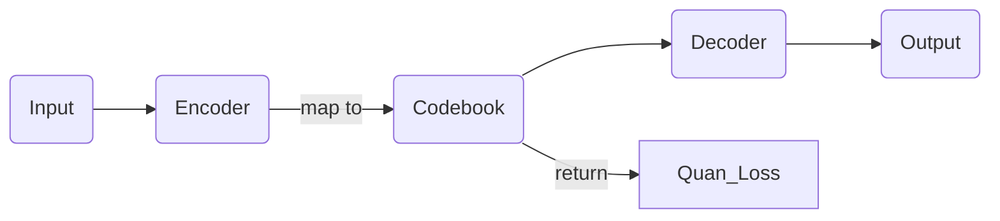

#  Goal of the project
To reproduce **Reparo: Loss-Resilient Generative Codec for Video Conferencing**.
(https://arxiv.org/abs/2305.14135)

# Progress
implement Part 1: Codec

# Structure

# How to use
## 1. train the model with the data:

> step1: video to image

`python vtoi.py --path PATH_TO_VIDEO`

> step2: input the data and train the model
`python training_vqgan1.py --dataset-path DATASET_PATH --epochs NUM_OF_EPOCH`

## 2. reconstruct the input video with pretrained model

> DATASET_PATH: the path to the processed data in 1.step1

 `python video_reconstruct.py --dataset-path DATASET_PATH --num-images NUM_OF_IMAGE --checkpoint-path CHECKPOINT/XXX.pt --image-output IMAGE_OUTPUT_DIR --video-output VIDEO_OUTPUT_DIR`

# Sample Input & Output

> INPUT: 
see wave.mp4

> OUPUT: 
> see testvideo2.avi

# Citatation

       @misc{esser2021taming,
          title={Taming Transformers for High-Resolution Image Synthesis}, 
          author={Patrick Esser and Robin Rombach and Björn Ommer},
          year={2021},
          eprint={2012.09841},
          archivePrefix={arXiv},
          primaryClass={cs.CV} 	}

		https://github.com/dome272/VQGAN-pytorch
		https://arxiv.org/abs/2305.14135
