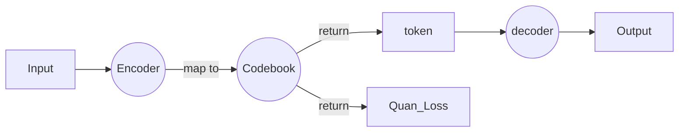

#  Goal of the project
To reproduce **Reparo: Loss-Resilient Generative Codec for Video Conferencing**.
(https://arxiv.org/abs/2305.14135)
## Introduction to Reparo

**Proposed Innovation:**  	
adapt the generative network to resolve the problem of video freeze caused by package loss and improve the video quality in real-time video conferrencing
	
**Network Structure:**  	
tokenizer(VQGAN) + bitcontroller+ packagizer + loss recovery module + decoder
 
# Progress
Implement Part 1: Tokenizer/Codec(VQGAN)

# Structure and explanations

**mingpt.py**: get a transformer

**lpips.py**: get a pretrained VGG16 model

**encoder.py**: encode

**decoder.py**: decode

**codebook.py**: quantize the vector (map it to the closest vector); return the quantized vector and the encoding index

**utils.py**: load and process the data for future use

**vqgan.py**: pull the encoder, codebook and decoder together to build a VQGAN model; return the codebook mapping, the encoding index and the loss; calculate and return $\lambda$ (balance the contribution of the perceptual loss and the GAN loss)

**vtoi.py**: transform videos to images

**train_vqgan1.py**: train and resume the model

**video_reconstruct.py**: reconstruct the video

# How to use
## 1. train the model with the data:

> step1: video to image

`python vtoi.py --path PATH_TO_VIDEO`

> step2: input the data and train the model
`python training_vqgan1.py --dataset-path DATASET_PATH --epochs NUM_OF_EPOCH`

## 2. reconstruct the input video with pretrained model

> DATASET_PATH: the path to the processed data in 1.step1

 `python video_reconstruct.py --dataset-path DATASET_PATH --num-images NUM_OF_IMAGE --checkpoint-path CHECKPOINT/XXX.pt --image-output IMAGE_OUTPUT_DIR --video-output VIDEO_OUTPUT_DIR`

# Sample Input & Output
> INPUT: 
> Input & Output/wave.mp4

> OUPUT: 
> Input & Output/testvideo2.avi

# Citatation

       @misc{esser2021taming,
          title={Taming Transformers for High-Resolution Image Synthesis}, 
          author={Patrick Esser and Robin Rombach and Björn Ommer},
          year={2021},
          eprint={2012.09841},
          archivePrefix={arXiv},
          primaryClass={cs.CV} 	}

		https://github.com/dome272/VQGAN-pytorch
		https://arxiv.org/abs/2305.14135
